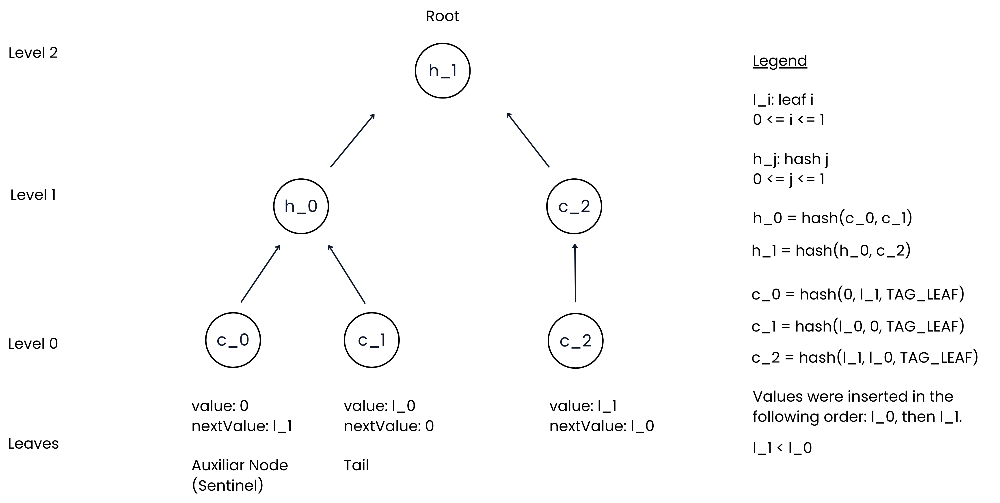

# LeanIMT+

LeanIMT+ is an optimized Incremental Merkle Tree designed to support efficient
membership **and non-membership** proofs.

Inspired by:

- [LeanIMT](https://zkkit.org/leanimt-paper.pdf)
- Indexed Merkle Tree: [paper](https://eprint.iacr.org/2021/1263.pdf) and [Aztec docs](https://docs.aztec.network/developers/docs/foundational-topics/advanced/storage/indexed_merkle_tree)

The result is a simple structure that allows:

- Efficient incremental insertions
- Compact membership proofs
- Efficient non-membership proofs
- Post-quantum safety (assuming the underlying hash function is post-quantum secure)

## Motivation

LeanIMT+ was built to provide an **efficient non-membership construction
for revocation in verifiable credentials**, for example proving a
credential is *not* revoked without scanning the whole set. The two most
popular options are Sparse Merkle Trees (SMT) and Indexed Merkle Trees,
and both have drawbacks:

- **Sparse Merkle Tree (SMT).** Requires a large tree depth
  (typically 128 or more), which is expensive in ZK because every proof
  must perform that many hashes.

- **Indexed Merkle Tree.** Uses a standard Merkle tree with no dynamic
  depth and also contains empty (zero-hash) leaves filling the unused positions.

LeanIMT+ keeps the indexed-leaf linked-list trick from the Indexed
Merkle Tree (cheap "low leaf" non-membership) but builds it on the
**LeanIMT** construction, so the depth stays **dynamic** and there are
**no zero hashes**.

## Overview

LeanIMT+ is a sorted incremental Merkle tree where:

- Leaves are linked together in **sorted order** by `value`.
- Each leaf stores two fields: `(value, nextValue)`. The "next" pointer
  is *implicit*: a leaf with `nextValue = v` points to the
  leaf whose `value = v`.
- Each leaf commits to its data as
  `leafHash = H_leaf(value, nextValue, TAG_LEAF)`, a **3-input** hash
  that is domain-separated from the 2-input internal-node hash
  (see [Implementation details](#implementation-details)).
- The base layer of the tree (`nodes[0]`) is the list of these
  `leafHash` values.
- Parent nodes follow the LeanIMT construction:
  `parent = H_internal(left, right)`. When a level has an odd number of
  nodes, the unpaired node is promoted unchanged to the next level (no
  zero hash, no extra hash call).

Rules:

- `0` is **not** a valid value.
- `0` is used only as a sentinel value and as the end-of-list marker.
- The last leaf in the linked list always has `nextValue = 0` (the
  end-of-list marker).

### Leaf states

A leaf record is just `{ value, nextValue }`. Its *state* is encoded
purely by those two fields; there is no separate type tag:

| State | `value` | `nextValue` | Where |
|---|---|---|---|
| **sentinel** | `0` | smallest real value (`> 0`) | always physical index `0` |
| **active** | `> 0` | next-larger value, or `0` if it is the tail | any index `≥ 1` |
| **tombstone** | `0` | `0` | a slot left behind by `remove` |

## Sentinel Leaf

The first leaf in the tree is always a sentinel:

```
value     = 0
nextValue = (smallest user value)
```

The sentinel is created together with the first user insertion. It
allows non-membership proofs for any value smaller than the smallest
user value.

Example after inserting `5, 10, 20`:

```
sentinel        first              middle          tail
(value, next)   (value, next)      (value, next)   (value, next)
[0, 5]          [5, 10]            [10, 20]        [20, 0]
```

## Construction

1. Each leaf commits to its data:
   `leafHash = H_leaf(value, nextValue, TAG_LEAF)`.

2. These hashes form the base layer of the tree (`nodes[0]`).

3. Parent nodes follow the LeanIMT construction:
   `parent = H_internal(leftChild, rightChild)`. Unpaired (odd) nodes
   are promoted unchanged to the level above.

This produces the final Merkle root.



## Insertion

To insert a new value `v`:

1. **Locate the low leaf**

   Find the active leaf `L` such that `L.value < v` and either
   `L.nextValue > v` or `L` is the tail. This is the **predecessor** of
   `v` in sorted order. The implicit linked list defines this leaf
   logically; the lookup itself is served by an auxiliary ordered index
   (AVL by default) in `O(log n)`. See
   [Implementation details](#implementation-details).

2. **Append the new leaf**

   Append the new leaf at a fresh physical slot. The new leaf inherits
   `L`'s old `nextValue`:

   ```
   newLeaf = { value: v, nextValue: L.nextValue }
   ```

3. **Rewire the low leaf**

   Update `L` so it points at the new value:

   ```
   L.nextValue = v
   ```

4. **Recompute hashes**

   Recompute only what changed:
   - the new leaf's commitment,
   - the low leaf's commitment (it changed),
   - every parent up to the root that depends on those two leaves.

Example, inserting `7` into a tree containing `5, 10`:

```
before
[0, 5] [5, 10] [10, 0]

insert 7

after
[0, 5] [5, 7] [10, 0] [7, 10]
```

(The new leaf is appended at the end *physically*, but logically sits
between `5` and `10` in the sorted linked list.)

## Removal

`remove(value)` does not physically delete a leaf. Merkle positions are
addressable, so the slot stays but is **tombstoned** to `{0, 0}`. Its
commitment becomes the canonical tombstone commitment
`H_leaf(0, 0, TAG_LEAF)`. The slot is never reused: once removed it stays
a tombstone for the life of the tree, and later inserts always append a
fresh slot.

Before tombstoning, the linked list is repaired: the predecessor of the
removed value takes over the removed leaf's `nextValue`, so the sorted
list stays intact.

Removing every value leaves a **drained** tree: only the sentinel and
tombstones remain. The next `insert` rewrites the sentinel and appends a
fresh slot, so the tree never needs to be rebuilt from scratch.

## Update

`update(oldValue, newValue)` replaces one value with another. All
preconditions are checked **before** any mutation, so the call either
succeeds fully or leaves the tree untouched. Internally it relinks the
sorted list around the old value and then splices the new value in, but
the new value is written **in place** into the old value's physical slot.
The leaf array never grows and no tombstone is created, so `update` is
strictly cheaper than a `remove` followed by a separate `insert`. A single
ancestor recompute runs at the end.

## Membership Proof

To prove that value `v` **is** in the tree:

1. Locate the leaf containing `value = v` (via the ordered index).

2. Generate a standard Merkle proof for that leaf using the LeanIMT
   structure.

To verify the Merkle proof, check that:

- The leaf's commitment equals `H_leaf(leaf.value, leaf.nextValue, TAG_LEAF)`.
- The Merkle path reconstructs the root.
- `leaf.value === v`.

## Non-Membership Proof

To prove that value `v` is **not** in the tree:

1. **Find the low leaf**

   Find the leaf `L` such that `L.value < v` and either `L.nextValue > v`
   or `L` is the tail (`L.nextValue = 0`). If `v` is smaller than every
   active value, the low leaf is the sentinel at index `0`.

2. **Generate a Merkle proof for `L`**

   Same shape as a membership proof, but the proof is for `L`, not for
   `v` itself.

3. **Verify the Merkle proof**

   Check that:

   - The Merkle proof of `H_leaf(L.value, L.nextValue, TAG_LEAF)`
     reconstructs the root.
   - The ordering condition: `L.value < v` AND
     (`L.nextValue > v` OR `L.nextValue = 0`).
   - The **tombstone replay guard**: a leaf with `value = 0` is only
     valid as a low leaf at index `0` (the sentinel). Any other
     `value = 0` leaf is a tombstone and is rejected.

   If all hold, `v` cannot exist in the tree without breaking the
   sorted-list invariant.

### Unified proof generation

`generateProof(value)` returns a single proof type discriminated by a
numeric `proofType` (`0` = membership, `1` = non-membership), so both
cases flow through the same verification logic.

## Implementation details

These are properties of the reference implementation rather than the
abstract construction. They are what make LeanIMT+ practical.

### Domain-separated hashing (second-preimage protection)

Leaf and internal nodes use **different hash arities**:

- Leaf commitment: `H_leaf(value, nextValue, TAG_LEAF)` (3 inputs).
- Internal node: `H_internal(left, right)` (2 inputs).

`TAG_LEAF` is a constant (default `1`) mixed into every leaf hash. The
different arity plus the tag act as **domain separation**: a leaf
commitment can never coincide with an internal-node hash. This closes a
general second-preimage attack in which an attacker repackages an
internal node as a leaf (or vice versa) to forge a proof. The two hash
functions are supplied separately via
`LeanIMTPlusHashFunctions`:

```ts
const hashes = {
  leaf:     (a, b, c) => poseidon3([a, b, c]),
  internal: (a, b)    => poseidon2([a, b]),
}
```

### Ordered index for predecessor lookups (AVL by default)

The "walk the linked list" description is *logical*. Walking the implicit
list would be `O(n)` per insert and per proof. Instead, an auxiliary
**ordered index** keyed by `value` answers `find` and `predecessor`
queries, which is exactly what insertion, removal and non-membership
proofs need.

The default index is a self-balancing **AVL tree**
(`O(log n)` find / predecessor / insert / remove).

The index is pluggable: LeanIMT+ depends only on the small
`OrderedIndex` interface, so a skip list, B+ tree, or any other ordered
structure can be injected via the `orderedIndex` factory parameter
without touching the tree code.

### Tombstones

`remove` tombstones a slot (`{0, 0}`) instead of deleting it, because
Merkle leaf positions are addressable and shifting them would invalidate
every proof. A tombstoned slot is never reused: once removed it stays a
tombstone for the life of the tree, and every `insert` appends a fresh
slot (`_appendLeaf`). The verifier's tombstone replay guard prevents a
removed slot from being presented as a low leaf.

### Dynamic depth and odd-node promotion (no zero hashes)

LeanIMT+ inherits LeanIMT's depth behaviour: the tree depth is
`⌈log₂(numLeaves)⌉` and grows only as needed. When a level has an odd
number of nodes, the unpaired node is **promoted unchanged** to the next
level rather than being paired with a precomputed zero hash. This saves
a hash call and means there are no zero-subtrees to manage.

### Generic value type

The tree is generic over the leaf value type `N` (default `bigint`). A
custom `zero`, `one` (the `TAG_LEAF` constant), and strict-less-than
comparator `lt` can be supplied for non-`bigint` value types. The chosen
`zero` is reserved for the sentinel and the end-of-list marker, so no
real input value may equal it.

## Implementation

The reference implementation of LeanIMT+ is available in this repository
at [browser/LeanIMTPlus](./browser/LeanIMTPlus). Usage documentation
lives in [node/USAGE.md](./node/USAGE.md).

The implementation includes:

- LeanIMT+ data structure
- Incremental insertion (single and batched)
- Removal (tombstoning, no slot reuse) and update
- Unified proof generation (membership and non-membership)
- Unified proof verification (instance and static)
- Export / import of the full tree state with consistency validation

## Project Layout

```
leanimt-plus/
├── browser/                # Next.js demo app + reference implementation
│   └── LeanIMTPlus/src/    # Single source of truth for the data structure
│       ├── leanimt-plus.ts # Tree, proofs, export/import
│       ├── avl.ts          # Default ordered index (AVL tree)
│       ├── ordered-index.ts# OrderedIndex interface + factory type
│       └── types/          # Leaf, proof, and hash-function types
└── node/                   # Jest test suite + usage docs
    └── tests/              # Imports directly from ../../browser/LeanIMTPlus/src
```

## Related Constructions

LeanIMT+ is one point in the design space of "Merkle trees that support
non-membership proofs". Related constructions worth comparing:

- **LeanIMT**: fast and append-only; supports only membership proofs.
- **Indexed Merkle Tree**: uses the indexed-leaf trick for non-membership;
  fixed depth.
- **Sorted IMT**: keeps leaves in sorted order rather than insertion
  order, requiring shifts on insert.
- **LeanIMT + sorted-leaves index + binary search (or AVL or Red-Black tree)**: adds an external sorted index over
  insertion-ordered leaves to speed up predecessor queries.
